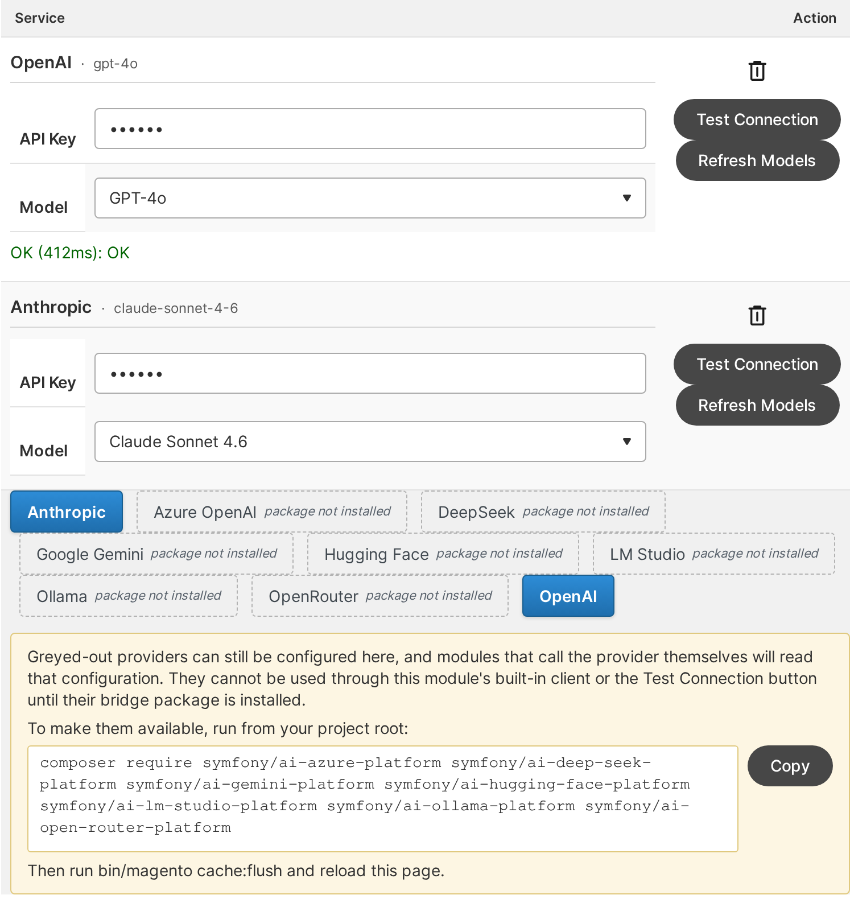
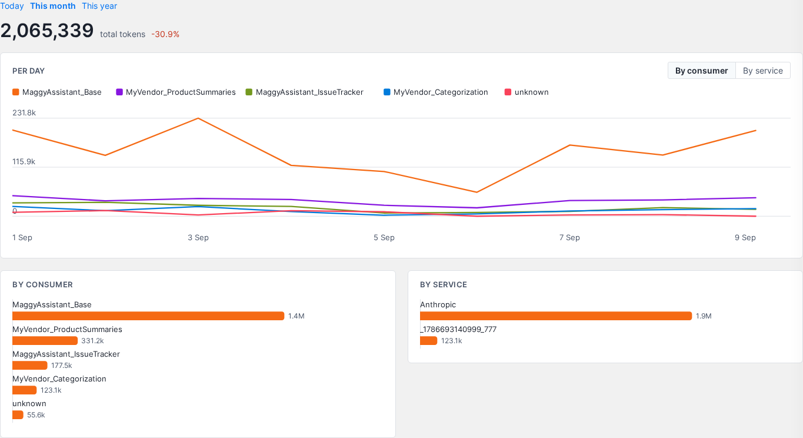

# Mage-OS AI Base

One place in Magento to configure your AI providers, one client every module can use to call them,
and a dashboard that shows what each module spends.

<table>
  <tr>
    <td width="50%"><a href="docs/images/admin-configuration.png"></a></td>
    <td width="50%"><a href="docs/images/admin-usage-dashboard.png"></a></td>
  </tr>
  <tr>
    <td align="center">Stores &gt; Configuration &gt; Mage-OS &gt; AI Configuration</td>
    <td align="center">Reports &gt; AI Token Usage</td>
  </tr>
</table>

## What it provides

- **Provider configuration.** OpenAI, Anthropic, Google Gemini, Azure OpenAI, DeepSeek, OpenRouter, Opper,
  Hugging Face, Ollama, LM Studio and any OpenAI-compatible gateway. Add a provider more than once,
  name each row, switch rows off, test the connection and refresh the model list from the form. API
  keys are encrypted at rest and never shown again.
- **One client for every provider.** Chat, streaming, tool calls and reasoning through a single
  interface. Options like `max_tokens` and `tool_choice` are translated per provider, and failures
  come back as typed exceptions you can retry or skip.
- **Let the admin choose.** A ready-made source model for your own `system.xml`, so a store picks
  which configured service your feature uses.
- **Usage tracking.** Token counts per module, service and store, on a dashboard, a grid and a CLI
  report. Prompts and responses are never stored.
- **Extensible.** Add your own provider with one class and a few lines of `di.xml`.

## Installation

```bash
composer require mage-os/module-ai-base
bin/magento module:enable MageOS_AiBase
bin/magento setup:upgrade
```

Requires Magento 2.4.8+ or Mage-OS 1.1+, and PHP 8.2+. OpenAI and Anthropic work out of the box; every
other provider needs its Symfony AI bridge package, which the admin form names when it's missing.

The client is built on [symfony/ai-platform](https://github.com/symfony/ai) 0.14, which is
experimental. This module's `Api` interfaces absorb its changes; code that reaches the Symfony
platform directly does not.

## Usage

```php
use MageOS\AiBase\Api\AiClientFactoryInterface;

class ProductSummary
{
    public function __construct(
        private readonly AiClientFactoryInterface $aiClientFactory,
    ) {
    }

    public function summarize(string $description): string
    {
        return $this->aiClientFactory
            ->create(consumer: 'Vendor_ProductSummary')
            ->complete('Summarize this product description: ' . $description);
    }
}
```

`chat()` and `streamChat()` cover conversations, tools and streaming. The
[Consumer Guide](docs/CONSUMING.md) has the full picture.

## Documentation

- [Consumer Guide](docs/CONSUMING.md): make AI calls, handle failures, let the admin pick a service, what's stable
- [Provider Guide](docs/PROVIDERS.md): add a provider, wire a client bridge, the admin form
- [Usage Tracking](docs/USAGE-TRACKING.md): what is recorded, where to see it, retention
- [Architecture](docs/ARCHITECTURE.md): components, data flows, security model, design decisions

## Contributing

See [CONTRIBUTING.md](CONTRIBUTING.md) and our [Code of Conduct](CODE_OF_CONDUCT.md).

## Security

Please report vulnerabilities privately, as described in [SECURITY.md](SECURITY.md), not in a public issue.
